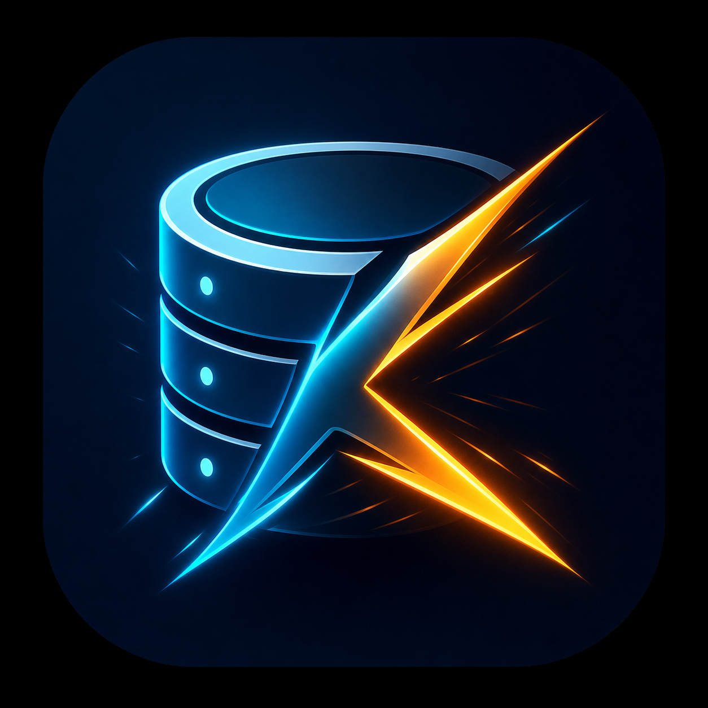

# KamehaDB

<p align="center">
  <a href="https://kamehadb.astalife.co">
    
  </a>
</p>

**KamehaDB** is a local-first, cross-platform database GUI with built-in AI that connects to PostgreSQL, MySQL, SQLite, MongoDB, Redis, SQL Server, Oracle, ClickHouse, DuckDB, and TigerBeetle — letting you browse schemas, run queries, and generate SQL through conversation.

## Features

- **12+ engines, one app** — SQL, document, cache, vector, and ledger systems side by side: PostgreSQL, MySQL, MariaDB, SQLite, SQL Server, Oracle, ClickHouse, DuckDB, MongoDB, Redis, Qdrant, TigerBeetle
- **Local-first** — All metadata stored locally in a SQLite database; nothing leaves your machine. No hosted proxy, no telemetry
- **AI with real schema context** — multi-provider chat (OpenAI, Ollama local + cloud, 9Router) reads your actual DDL, indexes, and constraints to generate SQL, MongoDB pipelines, Redis commands, and Qdrant searches. Streaming responses with stop/cancel
- **Schema timeline + migration assistant** — capture on-demand snapshots, see what changed between them, and auto-generate DDL to migrate from one state to the next
- **Global search (Ctrl+K)** — fuzzy search across connections, tables, columns, open tabs, and quick actions across every connected engine
- **Engine-native tooling** — PostgreSQL stats, MongoDB explorer with chart view, Redis key browser, Qdrant 3D vector map, TigerBeetle accounts/transfers
- **Query history with favorites** — normalized patterns, duration per group, per-connection
- **Charts** — bar, line, area, pie views on any query result or Mongo collection (powered by recharts)
- **Health monitoring** — live status badges with latency tracking; slow/reconnecting/offline states with tooltips
- **Schema browser & ER diagram** — auto-generated ER graphs via ReactFlow + dagre
- **Pin & workspace memory** — pinned connections and open tabs persisted to localStorage and restored on refresh
- **Schema-aware SQL editor** — Monaco with FK-aware JOIN/ON suggestions and autocomplete across tables, columns, functions, keywords
- **Connection URL** — paste `postgresql://`, `mysql://`, `redis://`, etc. to auto-fill connection fields

## Quick Start

```bash
# Install dependencies
pnpm install

# Start dev services
docker compose up -d

# Run the app (sidecar + desktop)
pnpm dev
```

Then open the desktop app, create a new connection pointing at `localhost`, and start exploring.

### AI Setup

Configure AI providers in the app settings (API Settings page):

| Provider       | Default Model | Notes                                    |
| -------------- | ------------- | ---------------------------------------- |
| Ollama (local) | `llama3.2`    | Uses `http://localhost:11434` by default |
| Ollama (cloud) | —             | Requires base URL and API key            |
| OpenAI         | `gpt-4o`      | Requires API key                         |
| 9Router        | Any model     | Requires base URL and API key            |

### Connection defaults (Docker)

| Engine      | Port | User    | Password | Database |
| ----------- | ---- | ------- | -------- | -------- |
| Engine      | Port | User    | Password | Database |
| ----------  | ---- | ------  | -------- | -------- |
| PostgreSQL  | 5432 | kameha  | kameha   | kamehadb |
| MySQL       | 3306 | kameha  | kameha   | kamehadb |
| MariaDB     | 3307 | kameha  | kameha   | kamehadb |
| Redis       | 6379 | —       | —        | —        |
| SQL Server  | 1433 | sa      | Kameha1! | kamehadb |
| Oracle      | 1521 | SYS     | oracle   | ORCLPDB1 |
| ClickHouse  | 8123 | default | default  | kamehadb |
| DuckDB      | 5432 | —       | —        | —        |
| TigerBeetle | 3000 | —       | —        | —        |

## Project Structure

```
kamehadb/
├── apps/
│   ├── desktop/          # Tauri v2 + React 19 frontend (Vite, Tailwind v4)
│   └── sidecar/          # Hono HTTP server + database adapters + metadata SQLite
├── packages/
│   ├── shared/           # Shared Zod schemas, app state types, adapter contracts
│   └── ui/               # Shared UI primitives
├── landing/              # Next.js marketing & docs site (managed with npm, separate lockfile)
├── docker-compose.yml    # Dev databases
└── docker-init/          # Seed SQL scripts for dev databases
```

## Running Tests

```bash
pnpm test
```

## Contributing

See [CONTRIBUTING.md](./CONTRIBUTING.md) for development setup, project conventions, verification requirements, and pull request guidance.

## macOS Gatekeeper

Unsigned macOS builds can still be used for local testing, but Gatekeeper may show messages such as `"KamehaDB" is damaged and can't be opened` or `"KamehaDB" cannot be opened because Apple cannot check it for malicious software`.

If you only need to test the app on your own Mac, try one of these:

1. Right-click `KamehaDB.app`, choose `Open`, then confirm.
2. Remove the quarantine attribute after copying the app to `Applications`:

```bash
xattr -dr com.apple.quarantine /Applications/KamehaDB.app
```

If the app is still being run directly from the mounted DMG:

```bash
xattr -dr com.apple.quarantine "/Volumes/KamehaDB/KamehaDB.app"
```

You can also disable Gatekeeper globally with `sudo spctl --master-disable`, but that is broader than necessary and should not be left enabled long-term.

### Build for Local Machine

If you see "Target does not exist" error, add the required Rust targets first:

```bash
rustup target add aarch64-apple-darwin x86_64-apple-darwin
```

Then build for your local machine:

```bash
# Apple Silicon (M1/M2/M3)
cd apps/desktop && pnpm tauri build --target aarch64-apple-darwin

# Intel Mac
cd apps/desktop && pnpm tauri build --target x86_64-apple-darwin
```

### Linux

```bash
# Build for Linux
cd apps/desktop && pnpm tauri build --target x86_64-unknown-linux-gnu
```

### Windows

```bash
# Build for Windows
cd apps/desktop && pnpm tauri build --target x86_64-pc-windows-msvc
```

## Tech Stack

- **Desktop**: Tauri v2, React 19, Vite, Tailwind CSS v4, Base UI (`@base-ui/react`), TanStack (Query, Store, Table)
- **Editor**: Monaco (via `@monaco-editor/react`), custom SQL autocomplete with FK-aware JOIN/ON hints, markdown rendering with `react-markdown`
- **Sidecar**: Hono, PostgreSQL (`pg`), MySQL (`mysql2`), SQLite (`better-sqlite3`), MongoDB (`mongodb`), Redis (`ioredis`), SQL Server (`mssql`), Oracle (`oracledb`), ClickHouse, DuckDB (`duckdb`), TigerBeetle (`tigerbeetle-node`)
- **Graph**: ReactFlow (`@xyflow/react`), dagre auto-layout
- **AI**: Multi-provider abstraction (OpenAI, Ollama local/cloud, 9Router)

## Roadmap

### Currently Supported

- [x] PostgreSQL
- [x] MySQL
- [x] SQLite
- [x] MongoDB
- [x] Redis
- [x] Data export (CSV, JSON, SQL)
- [x] Qdrant (vectordb)
- [x] SQL Server
- [x] Oracle
- [x] ClickHouse
- [x] DuckDB
- [x] Tigerbeetle
- [x] MariaDB

### Features

- [x] Query history with favorites
- [x] Data visualization / charts
- [x] Connection health monitoring
- [x] Global search (Ctrl+K)
- [x] Pin / favorites connections
- [x] Workspace tabs memory
- [x] Production safety mode — prevent accidental writes to production
- [x] PostgreSQL backup & restore

### In Progress

- [ ] Schema change timeline — track column additions, removals, index changes for debugging
- [ ] Migration assistant

### Future Ideas

- [ ] Collaboration features

## License

Apache-2.0 — see [LICENSE](./LICENSE).
